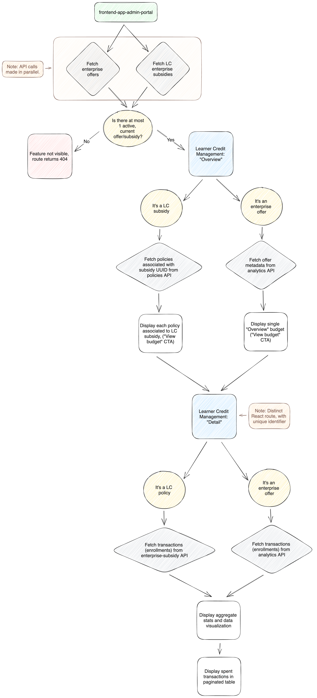

6. Data and routing for Learner Credit Management feature
=========================================================

Status
******

Accepted

Context
*******

Within the designed user flow for the Learner Credit Management (LCM) feature, there are two primary pages:

* Overview. Displays aggregate spend metadata for a single Learner Credit subsidy or a single legacy enterprise offer as a data visualization and with numbers displayed for percentage utilized and remaining funds. Lists the active "budgets" associated with the legacy enterprise offer or Learner Credit subsidy.
    * This page is the default landing page for the Learner Credit Management feature.
    * In the case of an enterprise offer, only a single "Budget" is displayed.
    * For new Learner Credit, all active budgets (i.e., subsidy access policies) associated to the Learner Credit subsidy are displayed.
    * Each "budget" displayed includes a "View budget" CTA that links users to the budget detail page route described below.

* Detail. Displays detailed information about specific transactions (i.e., enrollments) related to the enterprise offer or Learner Credit subsidy, as well as aggregate stats around remaining balance and a similar data visualization specific to the budget.
    * In the case of legacy enterprise offers, the singular detail page should display all transactions related to the offer. Although unlikely, this may include transactions across product lines (e.g., Open Courses vs. Executive Education).
    * With new Learner Credit, each budget detail page represents a policy (i.e., budget) associated with the Learner Credit subsidy. These budgets are typically split between product line based on the enterprise catalog tied to the policy, such that the transactions displayed only include a single product line (i.e., Open Courses or Executive Education).

Currently, the data sources for the Learner Credit Management feature include:

* Enterprise offers API
* Enterprise subsidy API
* Analytics API

The LCM feature first makes an API call to ecommerce to retrieve any enterprise offers, but also makes a similar API call in parallel to enterprise-subsidy to retrieve any Learner Credit subsidies.

The Learner Credit Management feature's current design only supports either a single enterprise offer or a single Learner Credit subsidy. It does not currently intend to support more than one enterprise offer or more than one Learner Credit subsidy.

Currently, the only data source for the Learner Credit Management page, once we've identified if we're working with an enterprise offer or Learner Credit subsidy, is the data  analytics API.

At the time of this writing, the analytics API returns data on a 12-hour delay. That is, the data warehouse processes the data backing the analytics API every 12 hours. This means that the data displayed on the Learner Credit Management page is currently on a 12-hour delay.

However, we intend to make these data more real-time when working with new Learner Credit subsidies, which implies no longer relying on the analytics API for the Learner Credit Management feature.

The challenge here is that we need data consistency between the overview and detail page routes, implying they will always need to rely on the same data sources. That is, if we change the data source for the detail page route to be more real-time, we also need to change the overview page route to be more real-time in lock step together.

Decisions
*********

As the Learner Credit Management feature is available for users today, with the goal of displaying both Learner Credit budgets (policies) while remaining backwards compatible with enterprise offers, we will continue to rely on the analytics API in the short term. This implies the current approach to replicate data about budgets (policies) from enterprise-access to the data warehouse and the analytics API by exposing a `EnterpriseSubsidyBudget` model to `edx-enterprise-data` (i.e., Django app installed into analytics API service).

This approach allows the analytics API to be able to list all budgets (policies) associated with a Learner Credit subsidy to support the overview page route, while still needing to rely on the analytics API for the detail page route as well.

That said, in the future, we intend to migrate the detail page route from the analytics API to make direct API call(s) to retrieve the requisite data in support of the detail page route. In doing so, we would be introducing inconsistency in data sources between the detail page route and overview page route. As such, we will also need to update the data source for the overview page route once the relevant APIs are available to support the more real-time data source to ensure data consistency across the entire feature.

As it relates to React routing for the Learner Credit Management feature, there will be two primary routes supporting both legacy enterprise offers and new Learner Credit subsdies simulatenously. The page routes are as follows: 

* **Overview**.
    * Both enterprise offer and Learner Credit subsidy: ``/:enterpriseSlug/admin/learner-credit``
* **Detail**.
    * Enterprise offer: ``/:enterpriseSlug/admin/learner-credit/:offerId``
    * Learner Credit subsidy: ``/:enterpriseSlug/admin/learner-credit/:policyUUID``

The Learner Credit Management feature should be aware of whether it's working with a legacy enterprise offer or a new Learner Credit subsidy. By knowing this, we will be able to identify which identifier is provided in the detail page route URL. That is, either the `offerId` (enterprise offer) or a `policyUUID` (Learner Credit policy) and eventually rely on different API sources for the feature depending on whether we're working with an enterprise offer or Learner Credit policy.

The decision tree as it relates to data sources and routing for the Learner Credit Management feature is depicted below:

Consequences
************

* The data source for Learner Credit Management feature will continue to be on the delay baked into the analytics API (i.e., 12 hours at the time of this writing) for the short term while the necessary API to support real-time data source for new Learner Credit is implemented. As a result, some of the work to get budgets (policies) metadata into the analytics API may be unnecessary in the long term once the data source is swapped to be more "real-time".
* We will introduce conditional logic within Learner Credit Management to rely on different data sources (i.e., APIs) when working with a legacy enterprise offer veruss a Learner Credit subsidy.
* We will need to ensure data sources are always consistent between the overview and detail page routes for the Learner Credit Management

Alternatives Considered
***********************

* Continue to rely on the (time-delayed) analytics API long term. This alternative is not ideal as product and UX would like the data to be more real-time for enterprise administrators. We could likely run the data processing more frequently for the analytics API to cut the 12-hour delay down to something more reasonable, but it'd still on a time delay.
* In the short term, rely directly on the enterprise-access policies REST API to fetch policies associated to the Learner Credit subsidy being viewed on the overview page route. This would allow us to avoid any data replication about budgets (policies) into the data warehouse or analytics API. However, it would may introduce data inconsistencies in the short term, which must be avoided.
